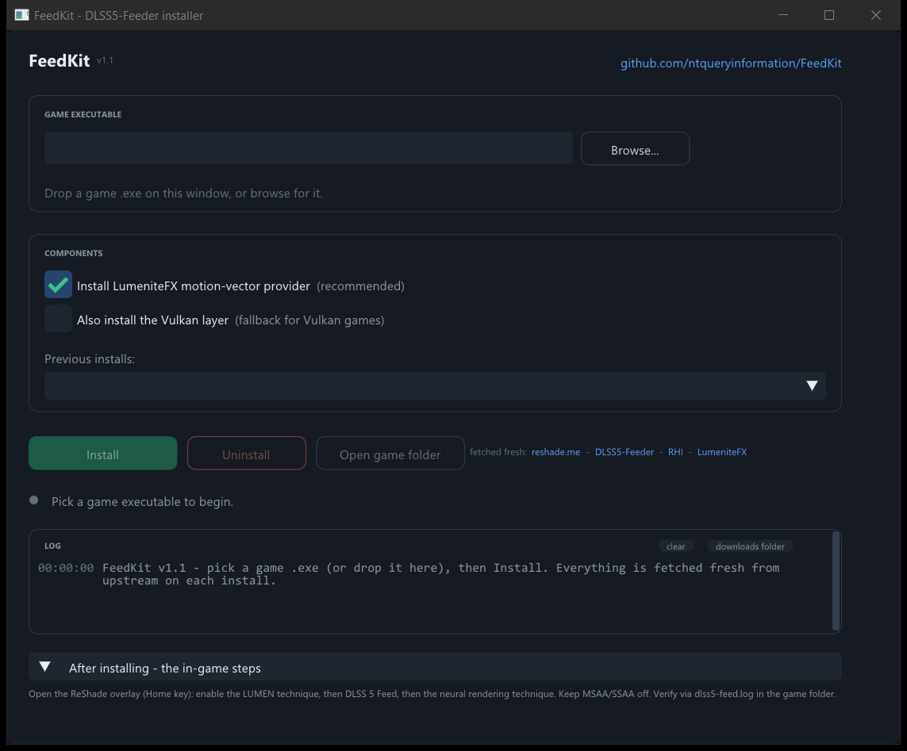

# FeedKit

**One-click installer for [DLSS5-Feeder](https://github.com/jlrouzies-fr/DLSS5-Feeder).**

FeedKit brings DLSS 5 neural rendering (DLAA) to games that ship without any DLSS - without the usual manual file shuffle. Pick a game executable, click **Install**, and FeedKit downloads the current files from their official sources and puts everything where it belongs. Click **Uninstall** and it's all gone, with any replaced files restored from backup.

> Native Windows app (Win32 C++ + Dear ImGui). No runtime dependencies - just download `FeedKit.exe` and run it.



---

## Requirements

- Windows 10 / 11 (x64)
- An NVIDIA RTX GPU supported by DLSS 5 neural rendering
- A D3D11 (or D3D10) game, 64-bit or 32-bit
- Internet access (FeedKit downloads everything at install time)

## Quick start

1. Download `FeedKit.exe` from [Releases](../../releases) (or build it yourself, see below).
2. Run it and pick your game's `.exe` - browse for it or just drag it onto the window.
3. Click **Install** and wait. First install downloads roughly 230 MB (the DLSS neural-rendering DLL alone is ~160 MB), so it can take a few minutes.
4. Launch the game and enable the effects in the ReShade overlay (see [After installing](#after-installing)).

## How it works

Nothing is bundled with FeedKit. **Every install fetches the current versions from upstream**, so you always get the latest Feeder build, the latest RenoDX DLSS5 add-on, and the DLSS DLL versions published by RHI:

| Component | Source | Files |
|---|---|---|
| ReShade (add-on support) | [reshade.me](https://reshade.me) | `dxgi.dll`, installed unattended by ReShade's own setup |
| DLSS5-Feeder | latest GitHub release of [DLSS5-Feeder](https://github.com/jlrouzies-fr/DLSS5-Feeder) | `dlss5-feed.addon64` / `dlss5-feed.addon32`, `DLSS5_Feed.fx` |
| RenoDX DLSS5 add-on | newest release in [RankFTW/rhi-repo](https://github.com/RankFTW/rhi-repo/releases) | `renodx-dlss5.addon64` |
| DLSS DLLs | DLSS versions published via [RHI's](https://github.com/RankFTW/RHI) `dlss_manifest.json` | `nvngx_dlssnr.dll` (ShortFuse build), `nvngx_dlss.dll` |
| LumeniteFX (recommended, on by default) | repo of [umar-afzaal/LumeniteFX](https://github.com/umar-afzaal/LumeniteFX) | `lumenite_*.fx`, `include\*.fxh`, bluenoise texture; also sets `DLSS5_MV_PROVIDER=3` in `ReShade.ini` |

## What gets installed where

**64-bit game** - files land next to the game `.exe`:

```
GameFolder\
├─ dxgi.dll                  (ReShade, add-on support)
├─ ReShade.ini               (DLSS5_MV_PROVIDER=3 preset when LumeniteFX is installed)
├─ dlss5-feed.addon64
├─ renodx-dlss5.addon64
├─ nvngx_dlssnr.dll
├─ nvngx_dlss.dll
└─ reshade-shaders\
   ├─ Shaders\
   │  ├─ DLSS5_Feed.fx
   │  ├─ ReShade.fxh, ReShadeUI.fxh, DrawText.fxh   (standard headers)
   │  ├─ lumenite_*.fx               (LumeniteFX)
   │  └─ include\lumenite_*.fxh      (LumeniteFX)
   └─ Textures\
      └─ lumenite_bluenoise256.png   (LumeniteFX)
```

**32-bit game** - the Feeder add-on runs in-process, and the 64-bit stack (RenoDX add-on + NGX DLLs) runs inside the bundled `host64` helper:

```
GameFolder\
├─ dxgi.dll                  (ReShade 32-bit, add-on support)
├─ ReShade.ini
├─ dlss5-feed.addon32
├─ reshade-shaders\          (DLSS5_Feed.fx + LumeniteFX files, as above)
└─ host64\
   ├─ dlss5-feed-host64.exe
   ├─ dxgi.dll               (ReShade 64-bit, add-on support)
   ├─ ReShade.ini
   ├─ renodx-dlss5.addon64
   ├─ nvngx_dlssnr.dll
   └─ nvngx_dlss.dll
```

Optional: a checkbox adds the Vulkan fallback layer (`VkLayer_feed_vk.dll`) for Vulkan games that miss the required interop extensions. If a file already exists (for example an `nvngx_dlss.dll` the game shipped with), FeedKit backs it up as `<name>.feedkit.bak` instead of overwriting it.

Everything FeedKit touches is recorded in `feedkit.install.json` in the game folder.

## After installing

The last steps happen in-game (FeedKit can't click ReShade's overlay for you):

1. **Motion vectors:** with the recommended LumeniteFX checkbox left on, the provider shaders are installed and `DLSS5_MV_PROVIDER=3` (LumeniteFX Kernel) is set in `ReShade.ini` for you - nothing to do. If you unchecked it, install a motion-vector provider yourself (LumeniteFX Kernel, or iMMERSE Launchpad / VORT / anything writing `texMotionVectors`) and set `DLSS5_MV_PROVIDER` accordingly in the preprocessor definitions of `DLSS5_Feed.fx`.
2. **Enable in the ReShade overlay** (Home key): enable the *LUMEN* technique, then *DLSS 5 Feed*, then the neural rendering technique. Keep MSAA/SSAA off.
3. **Verify** via `dlss5-feed.log` in the game folder.

## Uninstalling

Point FeedKit at the same game `.exe` and click **Uninstall**. It removes exactly what it installed (per `feedkit.install.json`) and restores any backups. If FeedKit installed ReShade itself, that goes too; ReShade you had already, and your shader folders, stay.

## Troubleshooting

- **`dlss5-feed.log`** in the game folder is the DLSS5-Feeder log - the [upstream README](https://github.com/jlrouzies-fr/DLSS5-Feeder#troubleshooting) explains its failure modes (missing motion vectors, silent hook misses, dgVoodoo VRAM errors for D3D9 games).
- **`ReShade.log`** covers ReShade/add-on loading.
- **"The game executable is locked"** - the game is still running. Close it first.
- **Install into `C:\Program Files\...` fails** - run FeedKit as administrator so it can write into the game folder.
- **D3D9 games** need [dgVoodoo2](http://dege.freeweb.hu/dgVoodoo2/) translation first (see the upstream README); FeedKit does not automate that step.
- FeedKit is single-player only territory: ReShade add-on support can trip anti-cheat in online games. Don't use it there.

## Building from source

1. Open `FeedKit.sln` in Visual Studio 2022 (Desktop C++ workload).
2. Build - that's it. No NuGet, no vcpkg, no external dependencies (Dear ImGui and miniz are vendored under `external/`, CRT is statically linked).

Or from the command line:

```
msbuild FeedKit.sln /p:Configuration=Release /p:Platform=x64
```

Output: `build\Release\FeedKit.exe`.

## Credits and legal

- [DLSS5-Feeder](https://github.com/jlrouzies-fr/DLSS5-Feeder) by jlrouzies-fr (MIT) - the actual magic. FeedKit is just an installer for it.
- [LumeniteFX](https://github.com/umar-afzaal/LumeniteFX) by umar-afzaal - the recommended motion-vector provider, installed by default.
- [RHI / RenoDX Commander](https://github.com/RankFTW/RHI) and the [rhi-repo](https://github.com/RankFTW/rhi-repo) release feed - source of the RenoDX DLSS5 add-on and the DLSS NR/SR DLL versions.
- [ReShade](https://reshade.me) by crosire - downloaded and installed from the official site; its binaries are not redistributed here.
- [RenoDX](https://github.com/clshortfuse/renodx) by ShortFuse and the RenoDX team.
- [miniz](https://github.com/richgel999/miniz) (MIT), vendored under `external/miniz`.

FeedKit is an unofficial community tool, MIT licensed (see [LICENSE](LICENSE)). Not affiliated with or endorsed by NVIDIA. NVIDIA, DLSS, and NGX are trademarks of NVIDIA Corporation; the DLSS DLLs are downloaded from the RHI project's release feed at install time and are not redistributed by this repository.
